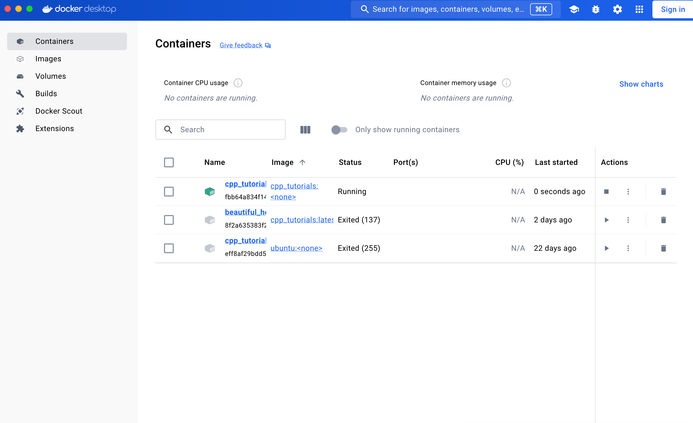
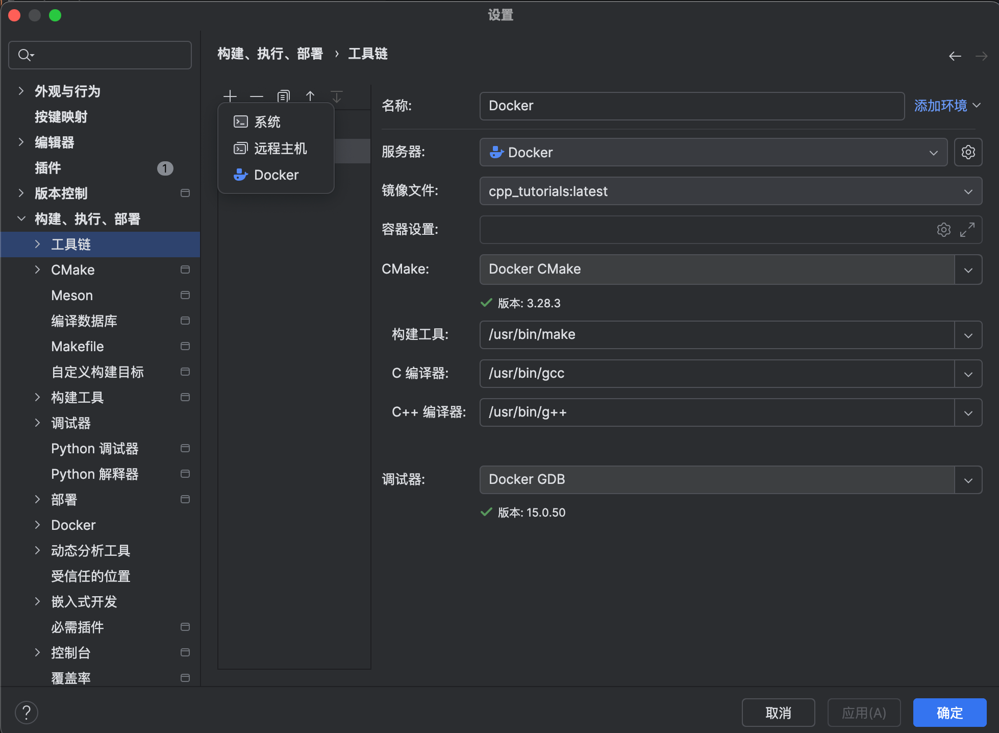
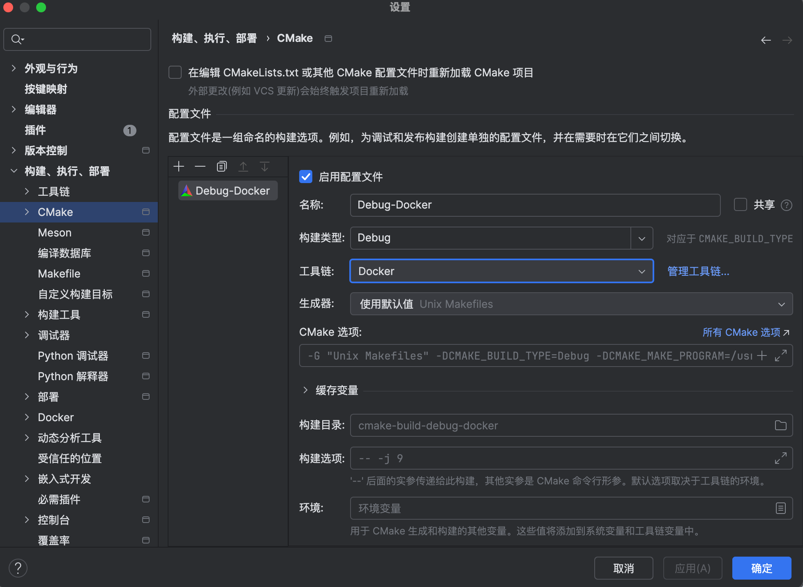

# 环境配置

由于本项目的代码需要用到linux系统下C++编译环境，所以我们需要进行以下配置

docker配置ubuntu

下载好 [docker desktop](https://www.docker.com/)

**[参考项目](https://github.com/xiaohejun/cpp_tutorials)**

完成参考项目后，大致是这样

配置clion

设置->工具链，选择docker，会自动生成构建工具和编译器 点击apply即可

然后选择cmake

工具链选择docker，点击apply即可完成

注意在cMakeLists.txt选择适应的cMake版本